<!-- README.md is generated from README.Rmd. Please edit that file -->

# WASABI

<!-- badges: start -->
<!-- badges: end -->

The goal of WASABI is to summarize the posterior distribution over the
space of partitions obtained after running a Bayesian mixture model. It
summarizes the posterior using several point estimates. These are
identified by approximating the empirical posterior distribution
(comprised by the posterior MCMC draws over the space of partitions)
with a discrete distribution supported on these $L$ point estimates
(called ‘particles’) in a Wasserstein sense (the Wasserstein
distribution is based on the Variation of Information (VI) distance).

**Reference:** Balocchi, C., & Wade, S. (2025). Understanding
uncertainty in Bayesian cluster analysis. [arXiv preprint
arXiv:2506.16295](https://arxiv.org/abs/2506.16295v1).

## Installation

You can install the development version of WASABI from
[GitHub](https://github.com/) with:

``` r
# install.packages("devtools")
devtools::install_github("cecilia-balocchi/WASABI")
```

## Examples

``` r
library(WASABI)
library(BNPmix)
library(mcclust)
library(salso)
library(superheat)
library(ggplot2)
```

#### Univariate data

Let’s first consider a simple bimodal (univariate) example:

``` r
set.seed(12345)
mu <- c(-1.1, 1.1)
prop <- c(0.5, 0.5)
n <- 600
components <- sample(1:2, size = n, replace = TRUE, prob = prop)
y <- rnorm(n, mean = mu[components], sd = 1)
hist(y, breaks = 20)
```

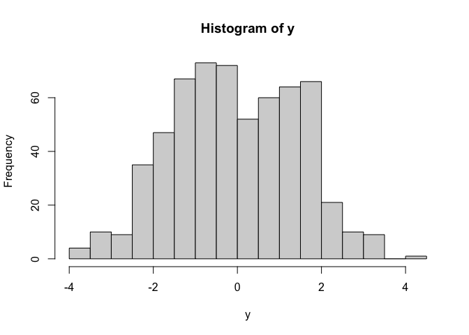

We fit a Bayesian mixture model (you can use your own code, or a package
such as BNPmix):

``` r
est_model <- BNPmix::PYdensity(y = y,
                               mcmc = list(niter = 6000,
                                           nburn = 5000,
                                           model = "LS",
                                           print_message = FALSE),
                               output = list(out_type = "FULL",
                                             out_param = TRUE))
cls.draw = est_model$clust
z_minVI <- salso::salso(cls.draw)
table(z_minVI)
#> z_minVI
#>   1 
#> 600
```

The minVI estimator is the partition with one cluster.

``` r
psm=mcclust::comp.psm(cls.draw+1)
superheat::superheat(psm,
                     pretty.order.cols = TRUE,
                     pretty.order.rows = TRUE)
```

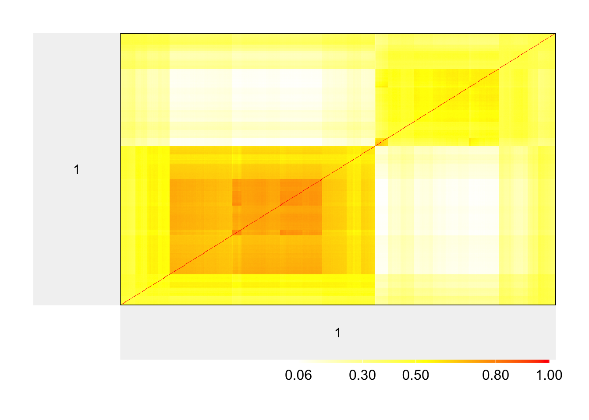

However the posterior similarity matrix shows a clear two-cluster
pattern, with moderate posterior uncertainty. Let’s use WASABI to
summarize the posterior with multiple point estimates:

``` r
out_WASABI <- WASABI(cls.draw, psm = psm, L = 2,
                     method.init = "topvi", method = "salso")
```

To explore multiple initializations, we can use `WASABI_multistart`. We
can also use the `mini.batch` option, to run the algorithm on a subset
of the data (for example: 150). When using `mini.batch` it’s advisable
to reduce the number of `max.iter` (for example to 10) and allow a small
number of `extra.iter` that are run with the full dataset after the
mini-batch part. This allows to allocate each MCMC sample in `cls.draw`
to one of the particles/regions of attractions, and for the algorithm to
stabilize after using mini-batch.

Note, the multi-core option relies on `parallel::mclapply` which only
works on MacOS and Linux. When running `WASABI_multistart` on Windows
machines, set `ncores = 1` (which is also the default).

``` r
out_WASABI_ms <- WASABI_multistart(cls.draw, psm = psm, L = 2,
                                   multi.start = 20, ncores = 4,
                                   mini.batch = 150,
                                   max.iter = 10, extra.iter = 4,
                                   method.init = "++", method = "salso")
```

We should use the solution achieving the smallest Wasserstein distance
(`wass.dist`):

``` r
if(out_WASABI_ms$wass.dist < out_WASABI$wass.dist){
  out_WASABI <- out_WASABI_ms
}
```

We can now visualize the particles, and there are different options:

- visualize the weight for each particle and their number of clusters

``` r
ggsummary(out_WASABI)
```

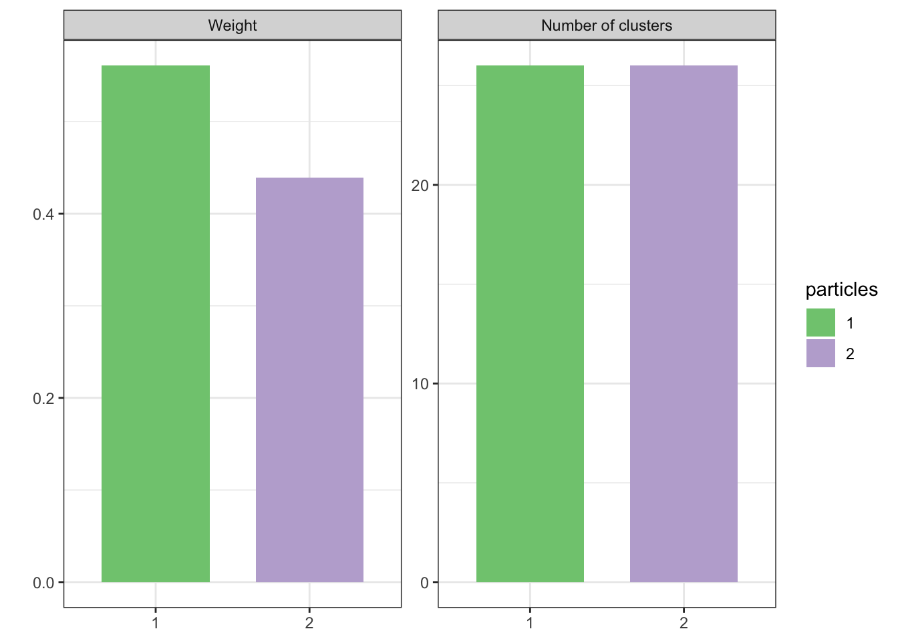

- visualize the the range for each particle’s cluster, side by side with
  the histogram of the data:

``` r
ggrange_hist(out_WASABI, y)
#> `stat_bin()` using `bins = 30`. Pick better value with `binwidth`.
```

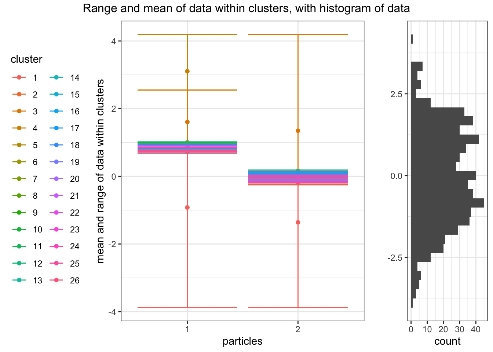

- visualize the data with the particles’ cluster assignment, as a
  scatterplot (by adding some jitter in the y-axis):

``` r
ggscatter_grid(out_WASABI, y)
```

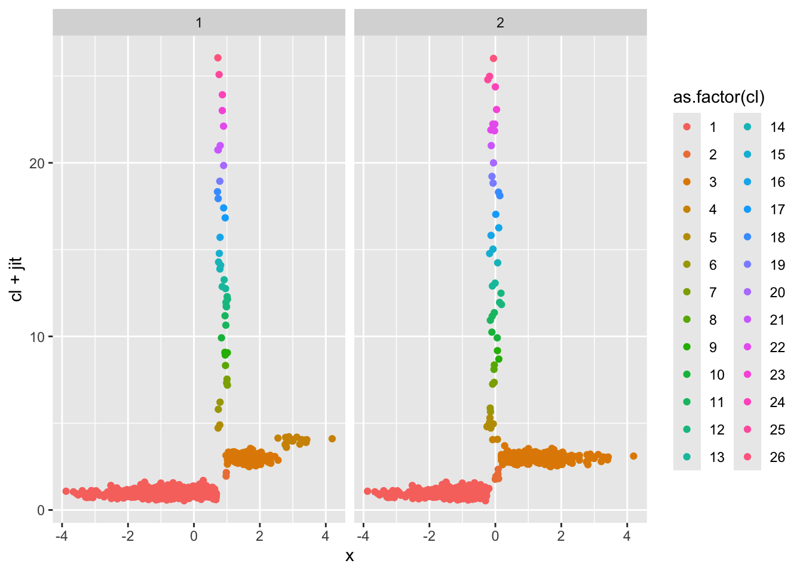

#### Two-dimensional data

``` r
m = 1.25
n = 600 
p = 2 
Kt = 4 

set.seed(4321)

Y=matrix(rnorm(p*n),n,p)
usim=runif(n)
ind=ifelse(usim<1/4,1,ifelse(usim<1/2,2,ifelse(usim<3/4,3,4)))
Y[ind==1,] = Y[ind==1,] +m
Y[ind==2,1] = Y[ind==2,1] + m; Y[ind==2,2] = Y[ind==2,2] - m;
Y[ind==3,] = Y[ind==3,] -m
Y[ind==4,1] = Y[ind==4,1] - m; Y[ind==4,2] = Y[ind==4,2] + m;

cls.true = ind
```

``` r
library(ggplot2)
ggplot() +
  geom_point(aes(x = Y[,1], 
                 y = Y[,2],
                 colour = as.factor(cls.true), 
                 shape  = as.factor(cls.true))) +  
  theme_bw() + guides(colour=guide_legend(title="Cluster"),
                      shape = guide_legend(title="Cluster")) + 
  xlab(expression("x"[1])) + ylab(expression("x"[2]))
```

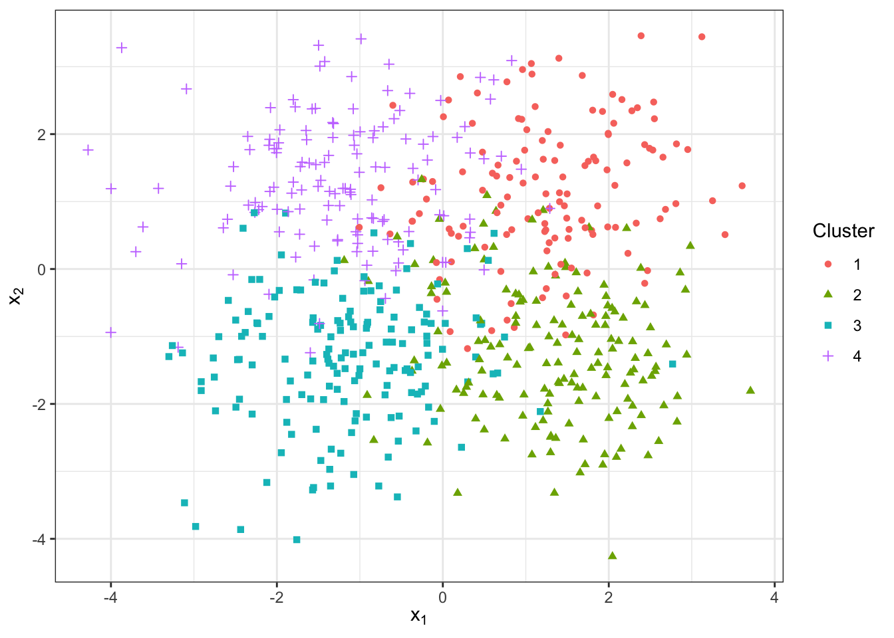

Let’s run the MCMC:

``` r
set.seed(4321)
### Parameters for DP mixture
alpha = 1
# using Fraley and Raftery recommendation
a_x=rep((p+2)/2,p)
khat = 4
b_x= rep(mean(apply(Y,2,var))/(khat^(2/p))/2,p)

### Parameters for MCMC function
S=1000
thin = 1
tot = S*thin
burnin=10000

est_model <- BNPmix::PYdensity(y = Y,
                       mcmc = list(niter = burnin + tot,
                                   nburn = burnin,
                                   model = "DLS",
                                   hyper = FALSE
                                   ),
                       prior = list(
                         k0 = 0.1*rep(1,p),
                         a0 = a_x,
                         b0 = b_x,
                         strength = alpha,
                         discount = 0),
                       output = list(out_type = "FULL", out_param = TRUE))
#> Completed:   1100/11000 - in 0.478067 sec
#> Completed:   2200/11000 - in 0.939248 sec
#> Completed:   3300/11000 - in 1.39589 sec
#> Completed:   4400/11000 - in 1.84335 sec
#> Completed:   5500/11000 - in 2.32279 sec
#> Completed:   6600/11000 - in 2.80815 sec
#> Completed:   7700/11000 - in 3.22682 sec
#> Completed:   8800/11000 - in 3.7245 sec
#> Completed:   9900/11000 - in 4.19597 sec
#> Completed:   11000/11000 - in 4.83649 sec
#> 
#> Estimation done in 4.83655 seconds
cls.draw = est_model$clust
psm=mcclust::comp.psm(cls.draw+1)
```

``` r
superheat::superheat(psm, pretty.order.rows = TRUE, pretty.order.cols = TRUE)
```

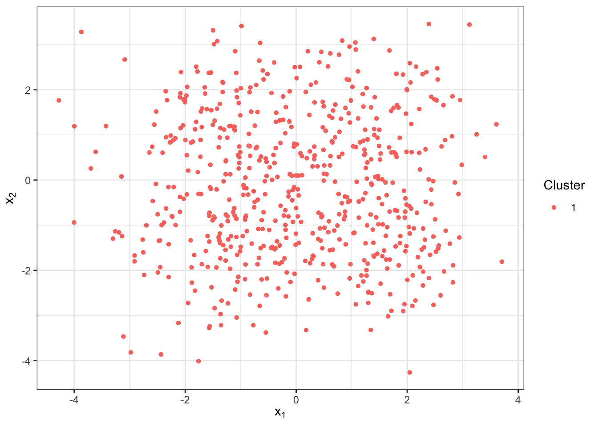

Let’s inspect the minVI estimator:

``` r
z_minVI <- salso::salso(cls.draw)
table(z_minVI)
#> z_minVI
#>   1   2 
#> 504  96
head(z_minVI)
#> [1] 1 1 2 1 1 1
df = data.frame(x1 = Y[,1], 
                x2 = Y[,2], 
                Cluster = z_minVI)
df$Cluster = as.factor(df$Cluster)

ggplot(df)+
  geom_point(aes(x = x1, y = x2, color = Cluster, shape = Cluster)) + 
  ylab(expression("x"[2]))+xlab(expression("x"[1]))+
  theme_bw()
```

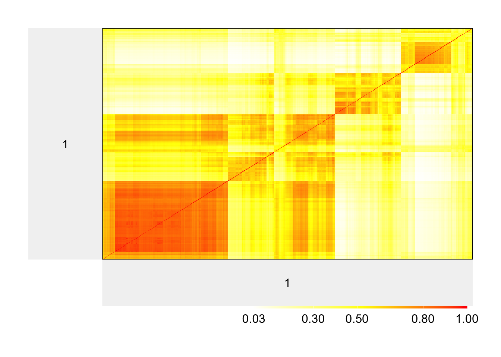

Let’s use the `elbow` function to choose the number of particles $L$
with the elbow method:

``` r
set.seed(123)
out_elbow <- elbow(cls.draw, L_max = 6, psm = psm,
                   multi.start = 1,
                   method.init = "topvi", method = "salso")
#> Completed  1 / 6 
#> Completed  2 / 6 
#> Completed  3 / 6 
#> Completed  4 / 6
#> Warning in salso::salso(x = cls.draw_relab[assign.vi == l, ]): The number of
#> clusters equals the default maximum possible number of clusters.
#> Completed  5 / 6
#> Warning in salso::salso(x = cls.draw_relab[assign.vi == l, ]): The number of
#> clusters equals the default maximum possible number of clusters.
#> Completed  6 / 6
plot(out_elbow$wass_vec, type = "b", ylab = "Wass distance")
```

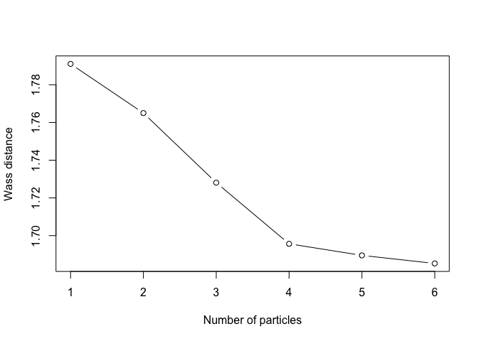

We can then choose $L = 3$.

``` r
L = 3
output_WASABI <- out_elbow$output_list[[L]]
```

Once the value of $L$ is chosen, we can run another set of
initializations to see if we can find a better approximation:

``` r
output_WASABI_mb = WASABI_multistart(cls.draw, psm,
                                    multi.start = 25, ncores = 4,
                                    method.init ="++", add_topvi = FALSE,
                                    method="salso", L=L,
                                    mini.batch = 200,
                                    max.iter= 10, suppress.comment=FALSE,
                                    swap_countone = TRUE,
                                    seed = 54321)
```

``` r
if(output_WASABI_mb$wass.dist < output_WASABI$wass.dist){
  output_WASABI <- output_WASABI_mb
}
```

``` r
ggsummary(output_WASABI)
```

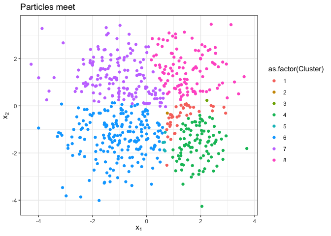

``` r
ggscatter_grid2d(output_WASABI, Y)
```

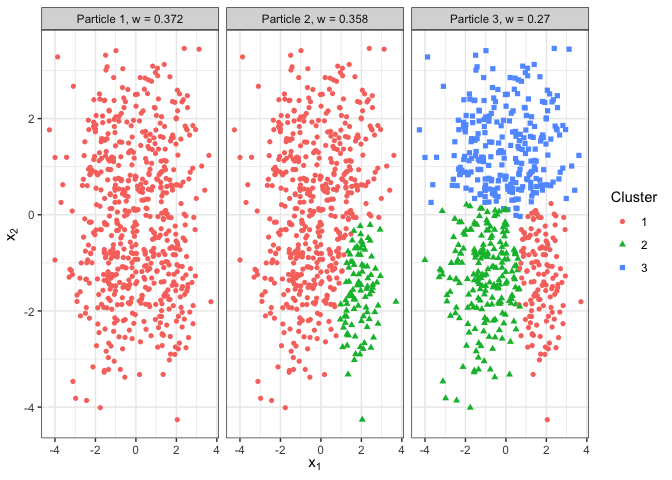

We can also find the meet of the particles:

``` r
output_meet = cls.meet(output_WASABI$particles)
z_meet = output_meet$cls.m
```

``` r
df_tmp <- data.frame(x1 = Y[,1],
           x2 = Y[,2],
           Cluster = z_meet)
ggplot(df_tmp) +
  geom_point(aes(x = x1,y = x2,
                 color = as.factor(Cluster))) +
  theme_bw() +
  xlab(expression("x"[1])) + ylab(expression("x"[2]))+
  ggtitle("Particles meet")+theme(legend.box = "horizotal")
```

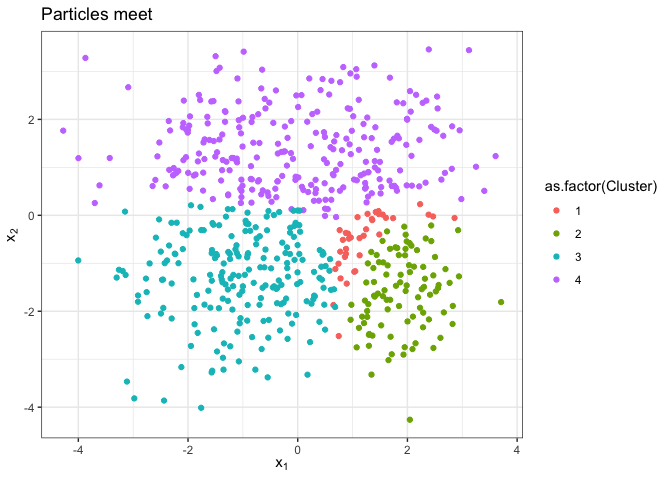

Let’s now look at the WASABI-approximation of the posterior similarity
matrix, which is defined on the meet’s clusters:

``` r
psm.m = psm.meet(z_meet, output_WASABI)
Km <- nrow(psm.m)
colnames(psm.m) <- 1:Km; rownames(psm.m) <- 1:Km
```

Let’s plot it and simultaneously compare the meet with one of the
particles (e.g. 2) We will now import `dplyr` to use the pipe, but
equivalent base R code can be used:

``` r
library(dplyr)
#> 
#> Attaching package: 'dplyr'
#> The following objects are masked from 'package:stats':
#> 
#>     filter, lag
#> The following objects are masked from 'package:base':
#> 
#>     intersect, setdiff, setequal, union
i = 2
part_cl = output_WASABI$particles[i,]
tb_meettop = table(part_cl,z_meet)
lbs_top = rownames(tb_meettop)[as.factor(apply(tb_meettop, 2, which.max))]

tmp = reshape2::melt(as.matrix(as.data.frame.matrix(tb_meettop))) %>%
  arrange(Var1,-value) %>% filter(value > 0) %>% pull(Var2)

superheat::superheat(psm.m,
                     title = paste('Meet vs Particle',i),
                     heat.pal = c("white", "yellow", "red"),
                     heat.pal.values = c(0,.5,1),
                     heat.lim = c(0,1), # this is important!!
                     row.title = paste('Particle',i),
                     column.title = paste('Meet'),
                     membership.rows = as.numeric(lbs_top),
                     order.cols = tmp,
                     order.rows = tmp)
```

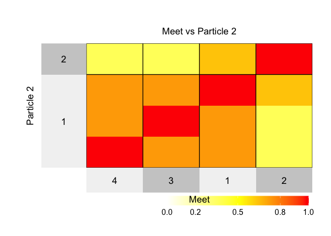

We can also look at the VI contribution of each point when comparing two
partitions (e.g. particle 2 and particle 3):

``` r
VIC_23 = vi.contribution(output_WASABI$particles[2,],output_WASABI$particles[3,])

ggplot() +
  geom_point(aes(x = Y[,1],
                 y = Y[,2],
                 color = VIC_23,
                 shape = as.factor(z_meet))) +
  theme_bw() +
  scale_color_distiller(name = "VIC",palette = "OrRd",direction = 1)+
  guides(shape = guide_legend(title="Meet\ncluster")) +
  xlab(expression("x"[1])) + ylab(expression("x"[2])) +
  ggtitle("VI Contribution between particle 2 and 3")
```

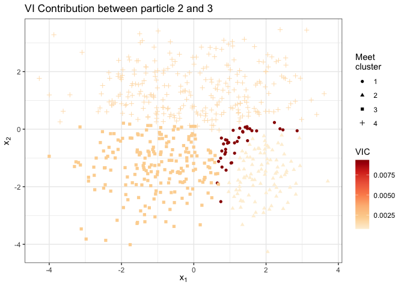

Or we can inspect the Expected VI (EVI) for a given estimator, such as
the meet of the particles

``` r
ec_full = evi.contribution(cls.draw, z_meet)

data.frame(x1 = Y[,1],
           x2 = Y[,2],
           VIC_full = ec_full,
           Cluster = as.factor(z_meet)) %>%
  ggplot() +
  geom_point(aes(x = x1,y = x2,
                 color = VIC_full,
                 shape = Cluster)) +
  scale_color_distiller("EVIC",palette = "OrRd",direction = 1)+
  # scale_shape_manual(values= c(18, 15,4, 8,19, 10,17))+
  theme_bw()+theme(legend.box = "horizotal") +
  guides(
    shape = guide_legend(title.position = "top", ncol = 3)
  )+ggtitle("EVIC for the meet")
```


<!-- You'll still need to render `README.Rmd` regularly, to keep `README.md` up-to-date. `devtools::build_readme()` is handy for this. -->
