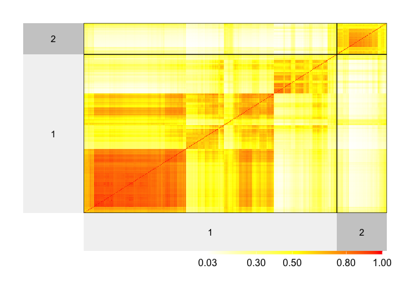
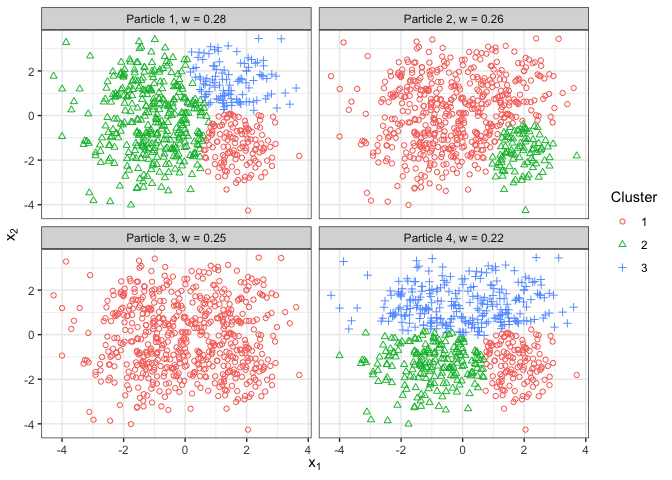
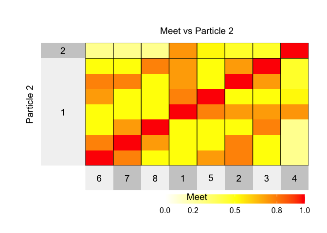
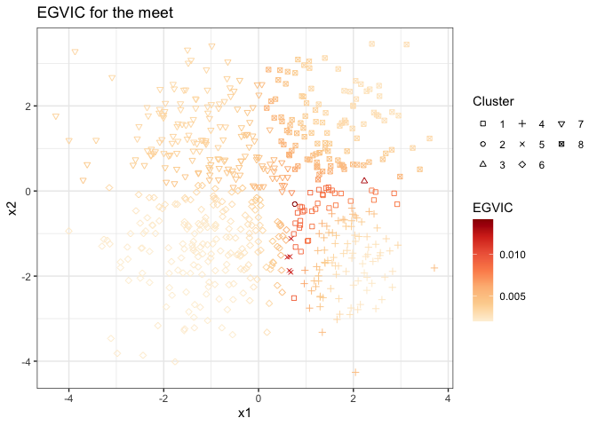

<!-- README.md is generated from README.Rmd. Please edit that file -->

# WASABI.ext

<!-- badges: start -->

<!-- badges: end -->

The goal of WASABI.ext is to extend the WASABI framework with more novel
loss functions including Generalized Variation of Information (GVI),
Generalized “n-invariant” Binder’s loss (GnBinder) and one-minus
Adjusted Random Index (omARI).

**Reference:** Balocchi, C., & Wade, S. (2025). Understanding
uncertainty in Bayesian cluster analysis. [arXiv preprint
arXiv:2506.16295](https://arxiv.org/abs/2506.16295v1).

Guanyu, C. Uncertainty Quantification in Bayesian Clustering (Vacation
Scholarship Project Report): [View Full Report
(PDF)](report/Report.pdf).

## Installation

You can install the development version of WASABI from
[GitHub](https://github.com/) with:

``` r
# install.packages("devtools")
devtools::install_github("guanyu-chen-gy/WASABI.ext")
```

## Functions

In the package, we compute the loss functions using Cpp functions to
speed up and this part will demonstrate the improvement in speed
compared to the developed functions in salso package.

``` r
library(WASABI.ext)
library(microbenchmark)
library(salso)
```

First we generate two different partitions for 10000 data points, with
cluster 1 consisted of 4 clusters and cluster 2 consisted of 7 clusters.

``` r
cls1 <- matrix(sample(0:3,10000, replace = TRUE), nrow = 1)
cls2 <- matrix(sample(0:6,10000, replace = TRUE), nrow = 1)
```

#### Generalized VI

<figure>

<figcaption aria-hidden="true">GVI formula</figcaption>
</figure>

``` r
microbenchmark(
  salso = salso_loss <- salso::VI(cls1,cls2, a = 0.5),
  cpp = WASABI.ext:::VI_compute_Rcpp(cls1, cls2, 4, 7, a = 0.5),
  times = 100L
)
#> Warning in microbenchmark(salso = salso_loss <- salso::VI(cls1, cls2, a = 0.5),
#> : less accurate nanosecond times to avoid potential integer overflows
#> Unit: microseconds
#>   expr     min      lq      mean   median      uq     max neval
#>  salso 167.157 169.412 188.09119 177.5095 185.853 905.608   100
#>    cpp  21.525  22.099  32.68602  25.1945  28.741 735.991   100
```

#### Generalized “n-invariant” Binder’s loss

<figure>

<figcaption aria-hidden="true">GnBinder formula</figcaption>
</figure>

``` r
microbenchmark(
  salso = salso_loss <- salso::binder(cls1,cls2, a = 1.2),
  cpp = WASABI.ext:::Binder_compute_Rcpp(cls1, cls2, 4, 7, a = 1.2),
  times = 100L
)
#> Unit: microseconds
#>   expr     min       lq      mean   median      uq     max neval
#>  salso 137.104 140.7120 148.04813 142.2085 151.577 202.868   100
#>    cpp  21.730  29.2535  32.27643  30.2580  32.964  51.496   100
```

## Examples

We will show how the WASABI framework works on Generalized VI loss.

``` r
library(WASABI.ext)
library(BNPmix)
library(mcclust)
library(salso)
library(superheat)
library(ggplot2)
```

Let’s consider a two-dimensional example.

``` r
m = 1.25
n = 600
p = 2
Kt = 4

set.seed(4321)

Y=matrix(rnorm(p*n),n,p)
usim=runif(n)
ind=ifelse(usim<1/4,1,ifelse(usim<1/2,2,ifelse(usim<3/4,3,4)))
Y[ind==1,] = Y[ind==1,] +m
Y[ind==2,1] = Y[ind==2,1] + m; Y[ind==2,2] = Y[ind==2,2] - m;
Y[ind==3,] = Y[ind==3,] -m
Y[ind==4,1] = Y[ind==4,1] - m; Y[ind==4,2] = Y[ind==4,2] + m;

cls.true = ind
```

``` r
library(ggplot2)
ggplot() +
  geom_point(aes(x = Y[,1],
                 y = Y[,2],
                 colour = as.factor(cls.true),
                 shape  = as.factor(cls.true))) +
  theme_bw() + guides(colour=guide_legend(title="Cluster"),
                      shape = guide_legend(title="Cluster")) +
  xlab(expression("x"[1])) + ylab(expression("x"[2]))
```


Let’s run the MCMC:

``` r
set.seed(4321)
### Parameters for DP mixture
alpha = 1
# using Fraley and Raftery recommendation
a_x=rep((p+2)/2,p)
khat = 4
b_x= rep(mean(apply(Y,2,var))/(khat^(2/p))/2,p)

### Parameters for MCMC function
S=10000
thin = 1
tot = S*thin
burnin=5000

est_model <- BNPmix::PYdensity(y = Y,
                       mcmc = list(niter = burnin + tot,
                                   nburn = burnin,
                                   model = "DLS",
                                   hyper = FALSE
                                   ),
                       prior = list(
                         k0 = 0.1*rep(1,p),
                         a0 = a_x,
                         b0 = b_x,
                         strength = alpha,
                         discount = 0),
                       output = list(out_type = "FULL", out_param = TRUE))
#> Completed:   1500/15000 - in 0.503769 sec
#> Completed:   3000/15000 - in 0.963452 sec
#> Completed:   4500/15000 - in 1.42234 sec
#> Completed:   6000/15000 - in 2.03849 sec
#> Completed:   7500/15000 - in 2.64382 sec
#> Completed:   9000/15000 - in 3.32072 sec
#> Completed:   10500/15000 - in 4.0146 sec
#> Completed:   12000/15000 - in 4.66989 sec
#> Completed:   13500/15000 - in 5.30318 sec
#> Completed:   15000/15000 - in 5.96036 sec
#> 
#> Estimation done in 5.9604 seconds
cls.draw = est_model$clust
psm=mcclust::comp.psm(cls.draw+1)
```

Let’s inspect the minVI estimator:

``` r
z_minVI = salso::salso(x = cls.draw, loss = VI(a = 0.9))
table(z_minVI)
#> z_minVI
#>   1   2 
#> 501  99

df = data.frame(x1 = Y[,1],
                x2 = Y[,2],
                Cluster = z_minVI)
df$Cluster = as.factor(df$Cluster)

ggplot(df)+
  geom_point(aes(x = x1, y = x2, color = Cluster, shape = Cluster)) +
  ylab(expression("x"[2]))+xlab(expression("x"[1]))+
  theme_bw()
```


The minVI estimator is the partition with two cluster.

``` r
superheat::superheat(psm,
                     heat.pal = c("white", "yellow", "red"),
                     heat.pal.values = c(0,.5,1),
                     pretty.order.cols = TRUE,
                     pretty.order.rows = TRUE,
                     membership.rows = z_minVI,
                     membership.cols = z_minVI,
                     bottom.label.text.size = 4,
                     left.label.text.size = 4)
#> Warning: Using `size` aesthetic for lines was deprecated in ggplot2 3.4.0.
#> ℹ Please use `linewidth` instead.
#> ℹ The deprecated feature was likely used in the superheat package.
#>   Please report the issue to the authors.
#> This warning is displayed once every 8 hours.
#> Call `lifecycle::last_lifecycle_warnings()` to see where this warning was
#> generated.
```



However the posterior similarity matrix shows a potential four-cluster
pattern, with moderate posterior uncertainty.

Let’s use the `elbow` function to choose the number of particles $L$
that summarizes the posterior with multiple point estimates under WASABI
framework with the elbow method :

``` r
set.seed(123)
out_elbow <- elbow(cls.draw, L_max = 6, psm = psm,
                   multi.start = 1,
                   method.init = "topvi", method = "salso",
                   loss = "VI", a  = 0.9)
#> Completed  1 / 6 
#> Completed  2 / 6 
#> Completed  3 / 6 
#> Completed  4 / 6 
#> Completed  5 / 6 
#> Completed  6 / 6
plot(out_elbow$wass_vec, type = "b", ylab = "Wass distance", xlab = "Number of particles")
```


We can then choose $L = 4$.

``` r
L = 4
output_WASABI <- out_elbow$output_list[[L]]
```

Once the value of $L$ is chosen, we can run another set of
initializations to see if we can find a better approximation:

``` r
output_WASABI_mb = WASABI_multistart(cls.draw, psm,
                                    multi.start = 25, ncores = 4,
                                    method.init ="++", add_topvi = FALSE,
                                    method="salso", L=L,
                                    mini.batch = 500,
                                    max.iter= 10, extra.iter = 5,
                                    suppress.comment=FALSE,
                                    swap_countone = TRUE,
                                    seed = 54321,
                                    loss = "VI", a = 0.9)
```

We should use the solution achieving the smallest Wasserstein distance
(wass.dist):

``` r
if(output_WASABI_mb$wass.dist < output_WASABI$wass.dist){
  output_WASABI <- output_WASABI_mb
}
print(output_WASABI$wass.dist)
#> [1] 1.694767
```

We can now visualize the particles, and there are different options:

visualize the weight for each particle

``` r
ggsummary(output_WASABI)
```


visualize the the range for each particle’s cluster, side by side with
the histogram of the data:

``` r
ggrange_hist(output_WASABI, Y[,2])
#> `stat_bin()` using `bins = 30`. Pick better value `binwidth`.
```


visualize the data with the particles’ cluster assignment, as a
scatterplot (by adding some jitter in the y-axis):

``` r
ggscatter_grid2d(output_WASABI, Y)
```



We can also find the meet of the particles:

``` r
output_meet = cls.meet(output_WASABI$particles)
z_meet = output_meet$cls.m
```

``` r
df_tmp <- data.frame(x1 = Y[,1],
           x2 = Y[,2],
           Cluster = z_meet)
ggplot(df_tmp) +
  geom_point(aes(x = x1,y = x2,
                 color = as.factor(Cluster))) +
  theme_bw() +
  xlab(expression("x"[1])) + ylab(expression("x"[2]))+
  ggtitle("Particles meet")+theme(legend.box = "horizotal")
```


Let’s now look at the WASABI-approximation of the posterior similarity
matrix, which is defined on the meet’s clusters:

``` r
psm.m = psm.meet(z_meet, output_WASABI)
Km <- nrow(psm.m)
colnames(psm.m) <- 1:Km; rownames(psm.m) <- 1:Km
```

Let’s plot it and simultaneously compare the meet with one of the
particles (e.g. 2) We will now import `dplyr` to use the pipe, but
equivalent base R code can be used:

``` r
library(dplyr)
#> 
#> Attaching package: 'dplyr'
#> The following objects are masked from 'package:stats':
#> 
#>     filter, lag
#> The following objects are masked from 'package:base':
#> 
#>     intersect, setdiff, setequal, union
i = 2
part_cl = output_WASABI$particles[i,]
tb_meettop = table(part_cl,z_meet)
lbs_top = rownames(tb_meettop)[as.factor(apply(tb_meettop, 2, which.max))]

tmp = reshape2::melt(as.matrix(as.data.frame.matrix(tb_meettop))) %>%
  arrange(Var1,-value) %>% filter(value > 0) %>% pull(Var2)

superheat::superheat(psm.m,
                     title = paste('Meet vs Particle',i),
                     heat.pal = c("white", "yellow", "red"),
                     heat.pal.values = c(0,.5,1),
                     heat.lim = c(0,1), # this is important!!
                     row.title = paste('Particle',i),
                     column.title = paste('Meet'),
                     membership.rows = as.numeric(lbs_top),
                     order.cols = tmp,
                     order.rows = tmp)
```



We can also look at the Generalized VI contribution of each point when
comparing two partitions (e.g. particle 2 and particle 3):

``` r
VI_23 = vi.contribution(output_WASABI$particles[2,],output_WASABI$particles[3,], a = 0.9)

# manually specify shape codes (mix of open and filled)
shape_values <- c(0:9, 15:20)

ggplot() +
  geom_point(aes(x = Y[,1],
                 y = Y[,2],
                 color = VI_23,
                 shape = as.factor(z_meet))) +
  scale_shape_manual(values = shape_values) +
  theme_bw() +
  scale_color_distiller(name = "GVI",palette = "OrRd",direction = 1)+
  guides(shape = guide_legend(title="Meet\ncluster")) +
  xlab(expression("x"[1])) + ylab(expression("x"[2])) +
  ggtitle("Generalized VI Contribution between particle 2 and 3")
```


Or we can inspect the Expected Generalized VI Contribution (EVI) for a
given estimator, such as the meet of the particles

``` r
ec_full = evi.contribution(cls.draw, z_meet, a = 0.9)

data.frame(x1 = Y[,1],
           x2 = Y[,2],
           GVI_full = ec_full,
           Cluster = as.factor(z_meet)) %>%
  ggplot() +
  geom_point(aes(x = x1,y = x2,
                 color = GVI_full,
                 shape = Cluster)) +
  scale_shape_manual(values = shape_values) +
  scale_color_distiller("EGVIC",palette = "OrRd",direction = 1)+
  # scale_shape_manual(values= c(18, 15,4, 8,19, 10,17))+
  theme_bw()+theme(legend.box = "horizotal") +
  guides(
    shape = guide_legend(title.position = "top", ncol = 3)
  )+ggtitle("EGVIC for the meet")
```



<!-- You'll still need to render `README.Rmd` regularly, to keep `README.md` up-to-date. `devtools::build_readme()` is handy for this. -->
